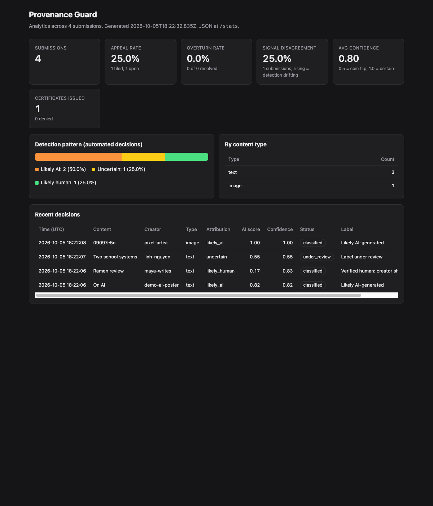

# Provenance Guard

Provenance Guard is a Flask backend that a creative-writing platform can plug in to estimate whether a submitted piece was AI-generated. It runs three independent detection signals (a Groq LLM judge, stylometric statistics and lexical markers), combines them into a score with an explicit **confidence**, and turns that into a plain-language **transparency label** for readers. Creators can **appeal** a label, or earn a **"Verified human" certificate** by sharing an earlier draft. Every decision goes into an append-only **audit log**, and the endpoints are **rate limited**. One rule drives the whole design: calling a human's work "AI" is worse than missing an AI piece, so the bar for an AI label is high and anything unclear is labelled "uncertain".

CodePath AI201, Project 4. Spec: [`planning.md`](planning.md). Calibration results: [`docs/calibration.md`](docs/calibration.md). Captured evidence: [`docs/evidence/`](docs/evidence/).

**Walkthrough video:** _TODO: paste link_

---

## Contents

1. [Quickstart](#quickstart)
2. [Architecture overview](#architecture-overview)
3. [Detection signals](#detection-signals)
4. [Confidence scoring](#confidence-scoring)
5. [Transparency label](#transparency-label)
6. [Appeals workflow](#appeals-workflow)
7. [Rate limiting](#rate-limiting)
8. [Audit log](#audit-log)
9. [Stretch features](#stretch-features)
10. [Known limitations](#known-limitations)
11. [Spec reflection](#spec-reflection)
12. [AI usage](#ai-usage)
13. [Repo layout](#repo-layout)
14. [Testing](#testing)

---

## Quickstart

```bash
git clone https://github.com/joshuadonatien/ai201-project4-provenance-guard.git
cd ai201-project4-provenance-guard

python3 -m venv .venv
source .venv/bin/activate
pip install -r requirements.txt

echo "GROQ_API_KEY=your_key_here" > .env     # free key from console.groq.com

PORT=5001 python app.py                      # server on http://localhost:5001
```

**Why port 5001?** On macOS, the AirPlay Receiver already listens on port 5000, so `flask` on 5000 gets "address in use" (or requests go to AirPlay). The app reads the `PORT` environment variable and defaults to 5000. The demo script and every example in this README use 5001. The database file defaults to `provenance.db`; set `PROVENANCE_DB=demo.db` to use a separate file (that's how the evidence in `docs/evidence/` was captured).

With the server running, in a second terminal:

```bash
bash scripts/demo.sh             # end-to-end: 3 text submissions, 1 image, appeal, reviewer queue, certificate, log, stats
bash scripts/demo.sh ratelimit   # 12 rapid submissions -> 10 x 201, then 429
python -m pytest -q              # 66 tests; the Groq client is stubbed, so no network or API key needed
python scripts/calibrate.py      # runs the 8 calibration texts against real Groq and rewrites docs/calibration.md
```

Then open http://localhost:5001/dashboard for the analytics page.

### Endpoints

| Method | Path | Body / query | Returns |
|---|---|---|---|
| POST | `/submit` | `{text, creator_id, title?, content_type?="text"}`, or for images `{content_type:"image", creator_id, metadata, description?}` | **201** + classification record |
| GET | `/content/<content_id>` | none | current record (status, label, scores, appeal) |
| POST | `/appeal` | `{content_id, creator_id, creator_reasoning, evidence_url?}` | **201** + appeal confirmation |
| GET | `/appeals` | `?status=open` (default) | reviewer queue, oldest first |
| POST | `/appeals/<content_id>/resolve` | `{decision: "upheld" \| "overturned", reviewer_note}` | updated record |
| POST | `/certificate` | `{content_id, creator_id, draft_text, process_notes}` | certificate, or 422 with the failed checks |
| GET | `/log` | `?limit=20` | `{"entries": [...]}`, newest first |
| GET | `/stats` | none | analytics JSON |
| GET | `/dashboard` | none | HTML analytics page |
| GET | `/health` | none | `{status, llm_available}` |

Errors are always JSON: `{"error": "<code>", "message": "<human sentence>"}`.

---

## Architecture overview

### Submission: from input to transparency label

1. The client sends `POST /submit` with `text` and `creator_id`.
2. **Flask-Limiter** checks the caller's quota (10/min, 100/day per IP). Over the limit returns a 429 JSON error.
3. **Validation** checks the text is 20 to 10,000 characters and `creator_id` is present. Bad input returns 400.
4. The raw text goes to **three independent signals**. Each returns an AI-likelihood between 0 and 1, or `available: false` if it couldn't run:
   - LLM judge on Groq (`detection/llm.py`)
   - Stylometric analyzer (`detection/stylometric.py`)
   - Lexical-marker analyzer (`detection/lexical.py`)
5. **Scoring** (`detection/scoring.py`) takes a weighted mean, applies the uncertainty adjustments (signal disagreement, short text, single signal), and maps the final `ai_score` to `likely_ai`, `uncertain` or `likely_human`.
6. The **label builder** (`labels.py`) turns the attribution into fixed reader-facing text.
7. **Storage** (`storage.py`) saves the current state in the `contents` table and appends a `submission` event to `audit_log`.
8. The response returns `content_id`, attribution, `ai_score`, `confidence`, every signal's score, weight and details, the adjustments applied, and the label.

### Appeal flow

The creator sends `POST /appeal`. I check that the content exists (404), that the caller is the creator (403), that the reasoning is substantive (400) and that no appeal is already open (409). The status becomes `under_review`, the label switches to the "under review" variant, and an `appeal_filed` audit event stores a snapshot of the original decision next to the creator's reasoning. A reviewer sees it in `GET /appeals` and resolves it with `POST /appeals/<content_id>/resolve`.

### Diagram (from `planning.md`)

```
 SUBMISSION FLOW
 ───────────────
  client ──(JSON: text, creator_id, content_type)──▶ POST /submit
                                                     │
                                     [Flask-Limiter: 10/min, 100/day per IP] ──over──▶ 429 JSON error
                                                     │ ok
                                     [validate: 20–10,000 chars, creator_id present] ──bad──▶ 400
                                                     │ raw text
                 ┌───────────────────────────────────┼────────────────────────────────────┐
                 ▼ raw text                          ▼ raw text                           ▼ raw text
     Signal 1: LLM judge (Groq)        Signal 2: Stylometrics (pure Py)     Signal 3: Lexical markers (pure Py)
     → llm_score ∈[0,1] + reasoning    → stylometric_score ∈[0,1] + metrics → lexical_score ∈[0,1] + hits
                 └───────────────────────────────────┼────────────────────────────────────┘
                                                     ▼ three signal scores (+ word count)
                              Scoring: weighted mean (0.50 / 0.30 / 0.20)
                                       → disagreement shrink → short-text shrink
                                       → ai_score ∈[0,1], confidence ∈[0.5,1], attribution
                                                     ▼ attribution + status
                              Label builder → label {variant, headline, body}
                                                     ▼ full record
                              Storage: contents table (current status) + audit_log (append-only event)
                                                     ▼
  client ◀──(JSON: content_id, attribution, ai_score, confidence, signals{}, label, status)──┘


 APPEAL FLOW
 ───────────
  creator ──(JSON: content_id, creator_id, creator_reasoning)──▶ POST /appeal   [limit 5/hour per IP]
                                                     │
                     [content exists? 404] [creator matches? 403] [reasoning ≥ 20 chars? 400] [already open? 409]
                                                     │ ok
                              contents.status: classified ──▶ under_review ; label ──▶ "under review" variant
                                                     ▼ original decision snapshot + reasoning
                              audit_log: event "appeal_filed"
                                                     ▼
  creator ◀──(JSON: appeal_id, content_id, status "under_review", original decision, message)──┘

  reviewer ──▶ GET /appeals (queue: excerpt, scores, signals, reasoning, filed_at)
  reviewer ──(decision: upheld | overturned, note)──▶ POST /appeals/<content_id>/resolve
                              → status "resolved_upheld" | "resolved_overturned" → audit_log "appeal_resolved"
```

---

## Detection signals

Every signal returns the same shape, so scoring treats them the same way:

```python
{"name": "llm", "score": 0.0–1.0 or None, "available": bool, "details": {...}}
```

`score` is always AI-likelihood (0 = reads fully human, 1 = reads fully AI). If a signal can't run, it's dropped and the remaining weights are renormalised.

### Signal 1: LLM judge (Groq, `openai/gpt-oss-120b`) — weight 0.50

- **What it measures:** the overall register of the text: generic "assistant voice", hedged and balanced framing, no lived specifics, over-smooth transitions. The model replies with JSON `{"ai_likelihood": 0–100, "reasoning": "<one sentence>"}` at temperature 0. I divide by 100 and clamp, and the one-sentence reasoning is shown to reviewers.
- **Why I chose it:** instruction-tuned models write in a recognisable register, and another LLM is good at recognising it. It is the only signal that reads meaning. That's why the ESL paragraph got a low LLM score (0.30) because of its personal anecdote, while the two statistical signals fired.
- **What it misses:** LLMs are badly calibrated and over-confident. They tend to read formal or non-native English as "AI" (the handout's monetary-policy paragraph got 0.70). They are fooled by AI text with slang injected (C3 got 0.20). Output isn't stable across model versions.
- **Model note:** the handout's `meta-llama/llama-4-scout-17b-16e-instruct` is no longer served by Groq (404, not in the model list). I use `openai/gpt-oss-120b` with `openai/gpt-oss-20b` as a fallback. Both are reasoning models, so `max_tokens` is 1024; a smaller budget gets used up by reasoning before the JSON answer.

### Signal 2: Stylometric heuristics (pure Python) — weight 0.30

- **What it measures:** structural statistics, combined as `0.45·burstiness + 0.35·word_length + 0.20·punctuation`:
  1. **Burstiness:** coefficient of variation of words per sentence. Humans mix 3-word and 30-word sentences (CV around 0.5 to 0.9); AI prose is metronomic (CV around 0.15 to 0.35). Ramp: CV 0.70 → 0.0, CV 0.20 → 1.0.
  2. **Average word length:** AI prose leans on long, Latinate words. Ramp: 4.2 chars → 0.0, 5.6 chars → 1.0. (MATTR vocabulary diversity is reported for reviewers but not scored.)
  3. **Informal punctuation per sentence:** `? ! … — ( ) "` and ALL-CAPS words. AI prose is mostly commas and periods. Ramp: 0.8 → 0.0, 0.0 → 1.0.
- Needs at least 3 sentences and 40 words, otherwise `available: false` (statistics on 2 sentences are noise).
- **Verse mode:** if the text looks like verse (short lines, mostly without end punctuation), each line counts as a unit and **burstiness is excluded**. A metrical poem has perfectly regular line lengths (C1 had CV 0.0), which would otherwise read as maximally "AI".
- **Why I chose it:** it's cheap, deterministic, explainable, and independent of the LLM, so it can disagree with it.
- **What it misses:** it is blind to meaning. Formal human writing (academic, legal, ESL) looks AI-uniform: the ESL paragraph scored 0.747. AI told to "vary sentence length" defeats burstiness, and the AI-with-slang text (C3) still scored 0.872, so on that case it was right and the LLM was wrong.

### Signal 3: Lexical markers (pure Python) — weight 0.20

- **What it measures:** rate of known LLM stock phrases ("it is important to note", "furthermore", "delve", "paradigm shift", "stakeholders", ...) versus informal human markers ("honestly", "lol", "kinda", lowercase "i", contractions, "my friend"). `score = clamp(0.5 + 0.18·ai_per_100w − 0.12·human_per_100w)`, so with no evidence it sits at 0.5.
- **Why I chose it:** signals 1 and 2 judge overall register and shape; this one counts specific surface tokens and is fully explainable ("matched: 'it is important to note', 'furthermore'"). It can fire when the other two are fooled.
- **What it misses:** easily beaten by find-and-replace. It penalises human writers who were taught formal connectives: the ESL paragraph hit "furthermore", "moreover" and "in conclusion" and scored 1.0. The phrase list goes stale as models change.

---

## Confidence scoring

### Combining

```
weights = {llm: 0.50, stylometric: 0.30, lexical: 0.20}   # renormalised over the signals that ran
raw     = Σ wᵢ·scoreᵢ / Σ wᵢ
```

The LLM gets the most weight but is capped at 50%, so it can never decide alone. Example: LLM 0.95 with two neutral heuristics (0.5) gives raw 0.725, which is uncertain, not AI. When stylometrics can't run (H3 and H4 below), the weights become 0.714 / 0.286.

### Two numbers: `ai_score` and `confidence`

- **`ai_score`** (0 to 1): estimated AI-likelihood after adjustments. This decides the attribution.
- **`confidence`** = `max(ai_score, 1 − ai_score)`, between 0.5 and 1: how sure I am of the attribution being shown. "likely_ai at 0.82" and "likely_human at 0.833" are both fairly sure. A confidence of 0.55 means about a coin flip, and it always lands in the uncertain band.

### Uncertainty adjustments (applied in this order, each recorded in `adjustments[]`)

Each one pulls the score toward 0.5: `s = 0.5 + (s − 0.5)·(1 − shrink)`.

| Adjustment | When | Shrink | Why |
|---|---|---|---|
| `signal_disagreement` | max signal − min signal > 0.45 | 35% | signals arguing means we don't know |
| `short_text` | < 25 words | 40% | captions and haiku: too little to judge; caps the score at 0.80 |
| `short_text` | 25–59 words | 15% | only a strong agreement of all signals can still reach 0.80 |
| `single_signal` | only one signal available | 50% | one signal alone is never enough |

### Thresholds (asymmetric on purpose)

| ai_score | Attribution | Label |
|---|---|---|
| **≥ 0.80** | `likely_ai` | Likely AI-generated |
| 0.35 – 0.80 | `uncertain` | Origin unclear |
| **≤ 0.35** | `likely_human` | Likely human-written |

**Why asymmetric:** a false positive (calling a person's work AI) damages a real person's reputation; a false negative costs readers some context. So the AI bar is far from 0.5 (0.30 away) and the human bar is closer (0.15 away), and the wide middle band says "we don't know" instead of guessing.

### How I validated it

`scripts/calibrate.py` runs the 4 handout texts plus 4 of my own against real Groq and prints every signal separately. Pass criteria (set in the spec before running): clear AI ≥ 0.80, clear human ≤ 0.35, borderlines in between. Result: **7/8 PASS** (full per-signal details in [`docs/calibration.md`](docs/calibration.md)).

| # | Input | Words | LLM | Stylometric | Lexical | Raw | Final ai_score | Confidence | Attribution | Adjustments | Expected | Result |
|---|---|---|---|---|---|---|---|---|---|---|---|---|
| H1 | Handout: clear AI | 43 | 0.850 | 0.839 | 1.000 | 0.877 | **0.820** | 0.820 | likely_ai | short_text | likely_ai (>= 0.8) | PASS |
| H2 | Handout: clear human | 55 | 0.100 | 0.194 | 0.000 | 0.108 | **0.167** | 0.833 | likely_human | short_text | likely_human (<= 0.35) | PASS |
| H3 | Handout: borderline formal human | 43 | 0.700 | n/a | 0.500 | 0.643 | **0.621** | 0.621 | uncertain | short_text | uncertain (0.35-0.8) | PASS |
| H4 | Handout: borderline edited AI | 39 | 0.350 | n/a | 0.808 | 0.481 | **0.489** | 0.511 | uncertain | signal_disagreement, short_text | uncertain (0.35-0.8) | PASS |
| C1 | Own: short repetitive poem (human) | 42 | 0.200 | 0.364 | 0.500 | 0.309 | **0.338** | 0.662 | likely_human | short_text | uncertain (0.35-0.8) | MISS |
| C2 | Own: ESL-style formal-but-human paragraph | 75 | 0.300 | 0.747 | 1.000 | 0.574 | **0.548** | 0.548 | uncertain | signal_disagreement | uncertain (0.35-0.8) | PASS |
| C3 | Own: AI text with injected slang | 73 | 0.200 | 0.872 | 0.829 | 0.527 | **0.518** | 0.518 | uncertain | signal_disagreement | uncertain (0.35-0.8) | PASS |
| C4 | Own: personal diary entry (~100 words) | 92 | 0.100 | 0.125 | 0.239 | 0.135 | **0.135** | 0.865 | likely_human | - | likely_human (<= 0.35) | PASS |

**The honest miss (C1).** I predicted my short repetitive poem (a human poem) would land in "uncertain". It scored 0.338, just under the 0.35 human threshold, so it was labelled `likely_human`. The prediction was wrong, but in the safe direction: it's a human poem and it got the human label. I left the thresholds alone rather than tune them to make one case pass.

### Two example submissions with noticeably different confidence

These are real `/submit` responses from [`docs/evidence/demo_run.txt`](docs/evidence/demo_run.txt).

| | High confidence: clear AI (H1) | High confidence: clear human (H2) | Low confidence: ESL paragraph (C2) |
|---|---|---|---|
| LLM | 0.85 | 0.10 | 0.30 |
| Stylometric | 0.839 | 0.194 | 0.747 |
| Lexical | 1.0 | 0.0 | 1.0 |
| Spread | 0.161 (agree) | 0.194 (agree) | 0.70 (disagree) |
| Raw → adjustments | 0.877 → short_text (15%) | 0.108 → short_text (15%) | 0.574 → signal_disagreement (35%) |
| **ai_score** | **0.82** | **0.167** | **0.548** |
| **confidence** | **0.82** | **0.833** | **0.548** |
| Attribution / label | likely_ai, "Likely AI-generated", "Our confidence: moderate" | likely_human, "Likely human-written", "Our confidence: moderate" | uncertain, "Origin unclear", "Our confidence: low" |

The difference is agreement. In H1 all three signals point the same way, so the score stays high even after the short-text shrink. In C2 the LLM read the personal anecdote ("When I was student in Hanoi") as human, while stylometrics (formal word length, no informal punctuation) and lexical ("furthermore", "moreover", "in conclusion") read it as AI. The spread of 0.70 triggered the disagreement shrink, pulling the score to 0.548. That's barely better than a coin flip, so the system says "Origin unclear" instead of accusing a human writer.

---

## Transparency label

The label is shown to readers under the piece. Text is fixed per variant (copied verbatim from `labels.py`) so it can be reviewed, translated and audited. No decimals appear in the label.

| Variant | When | Headline | Body |
|---|---|---|---|
| `high_confidence_ai` | ai_score ≥ 0.80 | **Likely AI-generated** | Our automated checks found strong signs that this piece was mostly or entirely generated by an AI tool. Automated checks can be wrong, and the creator can appeal this label. |
| `uncertain` | 0.35 – 0.80 | **Origin unclear** | Our automated checks couldn't tell with confidence whether a person or an AI tool wrote this piece. This note is here to give you context. It is not an accusation. |
| `high_confidence_human` | ai_score ≤ 0.35 (or appeal overturned) | **Likely human-written** | Our automated checks found the patterns we usually see in a person's own writing, and no strong signs of AI generation. |
| `under_review` | appeal open | **Label under review** | The creator has asked for this piece's label to be reviewed by a person. Until that review is done, treat the earlier automated result with caution. |
| `verified_human` | certificate issued | **Verified human: creator shared their drafts** | The creator completed an extra verification step by sharing an earlier draft that shows how this piece was revised over time. Certificate {certificate_id}, issued {date}. |

A detail line under the body gives the confidence in words (`confidence_text`):

| confidence | Text |
|---|---|
| ≥ 0.90 | `Our confidence: high` |
| 0.75 – 0.90 | `Our confidence: moderate` |
| < 0.75 | `Our confidence: low` |

Precedence when several apply: verified certificate > open appeal > reviewer overturn > automated attribution.

Real label from the clear-AI submission in `demo_run.txt`:

```json
"label": {
    "variant": "high_confidence_ai",
    "headline": "Likely AI-generated",
    "body": "Our automated checks found strong signs that this piece was mostly or entirely generated by an AI tool. Automated checks can be wrong, and the creator can appeal this label.",
    "confidence_text": "Our confidence: moderate"
}
```

### Design choices

- **Only the AI label mentions appeals.** It's the one label that can hurt someone, so it's the one that tells readers the creator can push back, and it says outright that "automated checks can be wrong".
- **The uncertain label disclaims accusation** ("It is not an accusation"), because most borderline cases are formal or non-native human writers.
- **The human label says "no strong signs"**, not "proven human". I can't prove an absence.
- **Confidence in words, not decimals.** "0.548" means nothing to a reader; "Our confidence: low" does.
- **Verified human has a different headline** and names the certificate id, so it is clearly a stronger claim than the automated "Likely human-written".

### Reader test

> **TODO (student):** show the three main labels (AI, uncertain, human) to someone who hasn't seen this project and ask what each one means to them and whether anything is confusing. Record who (e.g. "a friend who isn't technical"), what they said, and anything I changed because of it.
>
> - Person: _TODO_
> - What they understood: _TODO_
> - What confused them: _TODO_
> - What I changed: _TODO_

---

## Appeals workflow

- **Who can appeal:** only the creator. The `creator_id` in the request must match the one stored with the submission. (In production this would be the logged-in user; here the id in the body stands in for auth.)
- **What they provide:** `content_id`, `creator_id`, `creator_reasoning` (20 to 2,000 characters), optional `evidence_url`.
- **Validation:**

| Check | Status |
|---|---|
| content_id unknown | 404 |
| creator_id doesn't match the submission | 403 |
| reasoning missing, < 20 or > 2,000 chars | 400 |
| an appeal is already open for this content | 409 |
| more than 5 appeals/hour from this IP | 429 |

- **What changes:** `contents.status` goes from `classified` to `under_review`, the label switches to the `under_review` variant, and an `appeal_filed` audit event stores a **snapshot of the original decision** (attribution, ai_score, confidence, every signal score, adjustments) next to the reasoning.
- **Reviewer queue:** `GET /appeals` lists open appeals oldest first, with the reasoning, a 300-character excerpt, the original scores, per-signal scores, the LLM's reasoning sentence, the matched lexical phrases and the stylometric metrics, so a reviewer can see *why* the system decided what it did.
- **Resolution:** `POST /appeals/<content_id>/resolve` with `{"decision": "upheld" | "overturned", "reviewer_note": "..."}`. Status becomes `resolved_upheld` or `resolved_overturned` (overturned switches the label to "Likely human-written") and an `appeal_resolved` audit event is written. There's no automatic re-classification; a person decides.

### Real example (from `demo_run.txt`)

The ESL writer (`linh-nguyen`) appeals the "Origin unclear" label on submission 3.

Request:

```bash
curl -s -X POST http://localhost:5001/appeal -H "Content-Type: application/json" -d '{
  "content_id": "66a89d1d-d769-478e-af74-dd9a8082ac89",
  "creator_id": "linh-nguyen",
  "creator_reasoning": "I wrote this myself from personal experience. I am a non-native English speaker and my writing style may appear more formal than typical."
}'
```

Response (201):

```json
{
    "appeal_id": "AP-a4241fa27ff3",
    "content_id": "66a89d1d-d769-478e-af74-dd9a8082ac89",
    "status": "under_review",
    "filed_at": "2026-10-05T18:22:08.568Z",
    "original_decision": {
        "attribution": "uncertain",
        "ai_score": 0.548,
        "confidence": 0.548,
        "label_variant": "uncertain",
        "status": "classified",
        "signal_scores": {"llm": 0.3, "stylometric": 0.747, "lexical": 1.0},
        "adjustments": ["signal_disagreement"]
    },
    "label": {
        "variant": "under_review",
        "headline": "Label under review",
        "body": "The creator has asked for this piece's label to be reviewed by a person. Until that review is done, treat the earlier automated result with caution.",
        "confidence_text": "Our confidence: low"
    },
    "message": "Your appeal has been filed. A person will review this label; until then readers see a 'Label under review' notice."
}
```

`GET /content/66a89d1d-...` afterwards shows `"status": "under_review"` and the under-review label, and `GET /appeals` returns it with `"count": 1` (both in `demo_run.txt`, steps 6 and 7).

---

## Rate limiting

Flask-Limiter, keyed by client IP. Over the limit returns **429** with a JSON body.

| Endpoint | Limit | Reasoning |
|---|---|---|
| `POST /submit` | **10 per minute; 100 per day** | A real writer posts a few pieces per session; 10/min still lets someone upload a small poetry collection in one sitting. 100/day is an order of magnitude above even a very prolific poster (about 5 to 20 pieces a day), but it stops a script from using the service as a free AI detector or **probing the classifier** thousands of times to learn how to evade it. Each submit is one Groq call, and Groq's free tier for gpt-oss-120b is about 30 requests/min, so 10/min per client stops one abuser from draining the shared LLM quota. |
| `POST /appeal` | **5 per hour** | Appeals are rare and go to a human queue, so spam wastes reviewer time. |
| `POST /certificate` | **5 per hour** | Same reasoning: rare, and each one is a deliberate act by a creator. |

### Evidence: 12 rapid submissions ([`docs/evidence/rate_limit_run.txt`](docs/evidence/rate_limit_run.txt))

```
===== Rate limit: 12 rapid submissions (limit 10/minute) =====
request 1 -> HTTP 201
request 2 -> HTTP 201
request 3 -> HTTP 201
request 4 -> HTTP 201
request 5 -> HTTP 201
request 6 -> HTTP 201
request 7 -> HTTP 201
request 8 -> HTTP 201
request 9 -> HTTP 201
request 10 -> HTTP 201
request 11 -> HTTP 429
request 12 -> HTTP 429

===== Body of the last (rate-limited) response =====
{
    "error": "rate_limited",
    "message": "Too many requests. Please wait before trying again.",
    "limit": "10 per 1 minute"
}
```

Note: a successful submit returns **201 Created** rather than the 200 shown in the handout, because the request creates a new resource (a content record with an id).

**Limitations:** limits are keyed per IP, so users behind one NAT share a quota and an attacker with many IPs gets many quotas. Storage is in-memory, so counters reset when the server restarts and aren't shared between processes. In production I'd use Redis as the limiter backend and key on the authenticated account instead of the IP.

---

## Audit log

SQLite, table `audit_log`, **append-only** (rows are never updated). A separate `contents` table holds the current state of each piece. `GET /log?limit=N` returns entries newest first.

**Schema:** `id, timestamp (ISO-8601 UTC, ms), event_type (submission | appeal_filed | appeal_resolved | certificate_issued | certificate_denied), content_id, creator_id, content_type, attribution, ai_score, confidence, llm_score, stylometric_score, lexical_score, signals_used (JSON list), status, label_variant, appeal_reasoning, details (JSON)`.

Every row has the per-signal scores in their own columns, so I can query "all submissions where the LLM and stylometrics disagreed" without parsing JSON. `details` holds the extras: weights, adjustments, the original-decision snapshot for appeals, and the checks for certificates.

Sample of real entries from the demo run (trimmed to key fields; the full log is in [`docs/evidence/audit_log_sample.json`](docs/evidence/audit_log_sample.json)):

```json
[
  {
    "timestamp": "2026-10-05T18:22:08.569Z",
    "event_type": "appeal_filed",
    "content_id": "66a89d1d-d769-478e-af74-dd9a8082ac89",
    "creator_id": "linh-nguyen",
    "attribution": "uncertain",
    "ai_score": 0.548,
    "confidence": 0.548,
    "llm_score": 0.3,
    "stylometric_score": 0.747,
    "lexical_score": 1.0,
    "signals_used": ["llm", "stylometric", "lexical"],
    "status": "under_review",
    "label_variant": "under_review",
    "appeal_reasoning": "I wrote this myself from personal experience. I am a non-native English speaker and my writing style may appear more formal than typical."
  },
  {
    "timestamp": "2026-10-05T18:22:07.730Z",
    "event_type": "submission",
    "content_id": "66a89d1d-d769-478e-af74-dd9a8082ac89",
    "creator_id": "linh-nguyen",
    "attribution": "uncertain",
    "ai_score": 0.548,
    "confidence": 0.548,
    "llm_score": 0.3,
    "stylometric_score": 0.747,
    "lexical_score": 1.0,
    "signals_used": ["llm", "stylometric", "lexical"],
    "status": "classified",
    "label_variant": "uncertain",
    "appeal_reasoning": null
  },
  {
    "timestamp": "2026-10-05T18:22:06.989Z",
    "event_type": "submission",
    "content_id": "e0970439-603d-45a5-a47e-4e40ad0f4c3a",
    "creator_id": "maya-writes",
    "attribution": "likely_human",
    "ai_score": 0.167,
    "confidence": 0.833,
    "llm_score": 0.1,
    "stylometric_score": 0.194,
    "lexical_score": 0.0,
    "signals_used": ["llm", "stylometric", "lexical"],
    "status": "classified",
    "label_variant": "high_confidence_human",
    "appeal_reasoning": null
  },
  {
    "timestamp": "2026-10-05T18:22:06.340Z",
    "event_type": "submission",
    "content_id": "a60d0957-eabb-4eb3-b5e8-6c330a70a66c",
    "creator_id": "demo-ai-poster",
    "attribution": "likely_ai",
    "ai_score": 0.82,
    "confidence": 0.82,
    "llm_score": 0.85,
    "stylometric_score": 0.839,
    "lexical_score": 1.0,
    "signals_used": ["llm", "stylometric", "lexical"],
    "status": "classified",
    "label_variant": "high_confidence_ai",
    "appeal_reasoning": null
  }
]
```

The sample file also has the image `submission` and the `certificate_issued` event (6 entries total).

---

## Stretch features

### 1. Ensemble detection

- **What I built:** three independent signals (LLM judge, stylometric, lexical markers; see [Detection signals](#detection-signals)) combined in `detection/scoring.py`.
- **How it works:** weighted mean 0.50 / 0.30 / 0.20. Conflict resolution: (a) a weighted mean means no signal can decide alone; (b) if the spread between the highest and lowest signal is > 0.45 the result shrinks 35% toward 0.5; (c) missing signals are dropped and the weights renormalised, and a single surviving signal triggers a 50% shrink. Each signal's score and effective weight is in the response and the audit log.
- **Evidence:** the calibration table. The ensemble earned its keep on C2 and C3: on the ESL paragraph the LLM was right and the two heuristics were wrong; on AI-with-slang the heuristics were right and the LLM was wrong. In both cases the disagreement shrink produced "uncertain" instead of a confident mistake.

### 2. Provenance certificate ("Verified human: creator shared their drafts")

- **What I built:** `POST /certificate` (`certificate.py`). A creator submits an **earlier draft** of their piece plus a short note on how they wrote it. Real writing has revision history; someone passing off AI output usually has no earlier draft.
- **Checks** (all run, so the creator sees every failure): (1) caller is the creator; (2) the piece is not currently `likely_ai` (that has to go through appeal first); (3) draft ≥ 40 words; (4) process notes ≥ 40 characters; (5) word-level `difflib.SequenceMatcher` similarity between draft and final is **between 0.30 and 0.95**: similar enough to be the same piece, different enough to show real revision.
- **Result:** a certificate with id `PG-XXXXXXXX` is stored, the label switches to the distinct `verified_human` variant naming the certificate, and a `certificate_issued` event is logged. Failures return 422 with the failed checks and are logged as `certificate_denied`.
- **Evidence** (real response, `demo_run.txt` step 8, for the ramen review by `maya-writes`):

```json
{
    "certificate": {
        "certificate_id": "PG-EBFC1FE1",
        "content_id": "e0970439-603d-45a5-a47e-4e40ad0f4c3a",
        "creator_id": "maya-writes",
        "issued_at": "2026-10-05T18:22:08.700Z",
        "method": "draft_history",
        "draft_similarity": 0.694
    },
    "checks": [
        {"check": "creator_matches", "passed": true, "detail": "Caller is the creator of this piece."},
        {"check": "not_flagged_ai", "passed": true, "detail": "Current attribution is 'likely_human'."},
        {"check": "draft_length", "passed": true, "detail": "Draft has 43 words (minimum 40)."},
        {"check": "process_notes_length", "passed": true, "detail": "Process notes have 95 characters (minimum 40)."},
        {"check": "draft_similarity", "passed": true, "detail": "Similarity 0.694 (consistent with an earlier draft of this piece); must be between 0.3 and 0.95."}
    ],
    "label": {
        "variant": "verified_human",
        "headline": "Verified human: creator shared their drafts",
        "body": "The creator completed an extra verification step by sharing an earlier draft that shows how this piece was revised over time. Certificate PG-EBFC1FE1, issued 2026-10-05.",
        "confidence_text": "Our confidence: moderate"
    }
}
```

- **Honest limitation:** a determined faker can ask an AI for a "rough draft" too. The certificate raises the cost of faking; it doesn't prove authorship.

### 3. Analytics dashboard

- **What I built:** `GET /stats` (JSON) and `GET /dashboard` (HTML page in `templates/dashboard.html` that renders the stats).
- **Metrics:**
  1. **Detection pattern:** count and % of likely_ai / uncertain / likely_human. This uses the *original* attribution, so an overturned appeal doesn't rewrite history.
  2. **Appeal rate:** appeals filed ÷ submissions.
  3. **Overturn rate:** overturned ÷ resolved appeals. A high overturn rate means the detector is wrong on real people.
  4. **Signal disagreement rate (my extra metric):** % of submissions where the disagreement shrink fired. If it starts rising, the signals are drifting apart, for example because a new model writes in a way the phrase list doesn't know. It's an early warning that detection is degrading, before anyone files an appeal.
  5. Also: average confidence, submissions by content type, certificates issued/denied.
- **Evidence:** `/stats` from the demo run reported 4 submissions (2 likely_ai, 1 uncertain, 1 likely_human), appeal rate 25.0%, overturn rate 0.0%, signal disagreement rate 25.0%, average confidence 0.8, 1 certificate issued.



### 4. Multi-modal: images via structured metadata

- **What I built:** `POST /submit` with `content_type: "image"`, `creator_id`, a `metadata` object (EXIF/IPTC-style fields) and an optional `description` (alt text/caption). Detection is in `detection/image.py`.
- **How it works:** two signals, weighted **metadata 0.65 / LLM 0.35** (metadata is harder evidence than prose):
  - **Metadata provenance signal:** an AI generator named in `software`/`creator_tool` (Midjourney, DALL·E, Stable Diffusion, Firefly, ComfyUI, ...) → 0.95; IPTC `digital_source_type == "trainedAlgorithmicMedia"` → 0.97; generation keys like `prompt`/`seed`/`cfg_scale` → 0.9; camera make + model with exposure data → 0.15; make + model without exposure → 0.30; generator-typical square sizes (512/768/1024/2048) add +0.10; no evidence → 0.5.
  - **LLM judge** on the description + metadata, same JSON contract as the text judge.
  - Same thresholds, labels, appeals and audit log as text.
- **Evidence** (`demo_run.txt` step 4): metadata `{"software": "Midjourney v6", "width": 1024, "height": 1024, "prompt": "astronaut cat, nebula, cinematic lighting --ar 1:1"}` gave metadata score 1.0 (evidence: "AI generator named in software/creator tool: 'midjourney'" and "generator-typical square size 1024x1024 (+0.10)"), LLM 1.0, final **ai_score 1.0, likely_ai, "Our confidence: high"**.
- **Blind spot:** metadata is trivially stripped (screenshots, social-media re-encoding). Stripped metadata gives 0.5, which leads to "uncertain". I never analyse pixels.

---

## Known limitations

Each of these comes from a specific property of a signal:

1. **Formal human prose by non-native writers and academics.** Stylometrics rewards long words and no informal punctuation, and the lexical list counts "furthermore", "moreover", "in conclusion", which is exactly what ESL curricula teach. The ESL paragraph (C2) scored stylometric 0.747 and lexical 1.0 and ended at **0.548, uncertain**, even though a person wrote it. Only the LLM (0.30) kept it out of the AI band. If the LLM had also misread it, this writer could have been flagged.
2. **AI text with injected slang.** Adding "honestly lol", "kinda" and "tbh" fooled the LLM (0.20) and pulled the lexical score down. C3 ended **uncertain at 0.518** instead of AI. That's a false negative by design: I prefer it to a false accusation, but it means this evasion works.
3. **Short pieces and haiku.** Under 25 words the short-text shrink caps the score at exactly 0.80 and stylometrics can't run (needs 40 words and 3 sentences), so very short pieces essentially always land in "uncertain", whoever wrote them.
4. **Verse.** In verse mode, burstiness is excluded because metre sets line length, so for poetry stylometrics relies only on word length and punctuation, which is weaker. Repetitive simple poems lean human (C1 scored 0.338).
5. **Image metadata is trivially stripped,** so images without metadata are always "uncertain", and faked camera metadata would read as human.
6. **The LLM judge isn't deterministic across model versions and isn't calibrated.** Its 0–100 is a vibe, not a probability, and a Groq model update could shift every score. The handout's model already disappeared once during this project.
7. **`creator_id` stands in for authentication.** Anyone who knows a creator's id could appeal or request a certificate for their content. A real deployment needs logged-in sessions.
8. **One document-level score.** A human draft polished by AI gets one blended number; there's no per-paragraph attribution.

---

## Spec reflection

**How the spec helped.** Writing exact numbers into `planning.md` before any code (weights 0.50/0.30/0.20, thresholds 0.80/0.35, a 0.45 spread → 35% shrink, ramp endpoints) meant I could diff generated code against the spec instead of judging whether it "looked right". The edge-case list (§7) directly drove two features: poetry → verse mode, and AI-with-slang / ESL → the disagreement shrink. Fixing the label text in the spec made label tests trivial (assert the exact strings) and meant the AI tool couldn't "improve" the wording.

**Where I diverged, and why:**

1. **Short-text rule: flat → graded.** The spec said "< 60 words → shrink 40%". With that rule the best possible score below 60 words is 0.5 + 0.5 × 0.6 = **exactly 0.80**, and the handout's 43-word clear-AI sample (raw 0.877) scored **0.726**, so it could never be labelled AI. I changed it to graded: < 25 words → 40%, 25–59 words → 15%. H1 now scores 0.820. Even with 15%, one loud signal (LLM 0.95 + two neutral 0.5 → raw 0.725) still can't reach 0.80.
2. **Certificate similarity: character-level → word-level.** The spec said `difflib.SequenceMatcher` between draft and final. On characters, two **unrelated** paragraphs scored **0.303**, above the 0.30 floor, so unrelated text would pass. On word tokens the same pair scores **0.042**, while a real revised draft scored **0.606** (fixtures: `DRAFT`, `UNRELATED`, `FINAL` in `tests/test_certificate.py`).
3. **Stylometric verse mode excludes burstiness.** The spec didn't anticipate that metrical poetry has a sentence-length CV of 0 (C1: all lines 7 words), which reads as maximally "AI".
4. **Camera make/model without exposure data scores 0.30.** The spec only defined camera + exposure (0.15). Make/model alone is easy to type, so it leans human less.
5. **An `original_attribution` column** in `contents`, so an overturned appeal doesn't rewrite the analytics' detection pattern.
6. **Model swap.** `llama-4-scout` (handout) → `openai/gpt-oss-120b` with `gpt-oss-20b` fallback, because Groq no longer serves the handout model.

---

## AI usage

I built this by directing **Claude Code** (an AI coding agent), orchestrating several sub-agents. As in the AI Tool Plan in `planning.md`, each one got the relevant `planning.md` sections verbatim plus the architecture diagram as input, never a vague "make an AI detector". I checked the output against the spec numbers, ran the tests and calibration myself, and made the calls on what to change.

### 1. Detection and scoring

- **What I directed:** gave the agent §3 (signals) and §4 (uncertainty) plus the diagram, and asked for `stylometric_signal`, `lexical_signal` and `combine_signals()`.
- **What the AI produced:** a working implementation with the flat 40% short-text shrink for < 60 words, exactly as my spec said.
- **What I revised or overrode:** calibration showed the handout's clear-AI text capped at **0.726**, so it could never be labelled AI. The AI's easy fix would have been to lower the 0.80 threshold. I decided to change the short-text rule instead (graded: 40% under 25 words, 15% for 25–59), because thresholds are product decisions and the asymmetry protecting human writers has to stay. Ramps and shrinks are measurement, so those are what get tuned.

### 2. Provenance certificate

- **What I directed:** gave §9.2 and asked for the `/certificate` endpoint and its checks.
- **What the AI produced:** a literal implementation using character-level `difflib.SequenceMatcher`.
- **What I revised or overrode:** its own test showed two unrelated paragraphs passing at **0.303** similarity (above the 0.30 floor). I had it switch to word-level tokens: unrelated text dropped to 0.042, and a real revised draft scored 0.606.

### 3. The LLM model

- **What I directed:** wire up Signal 1 with the handout's model, `meta-llama/llama-4-scout-17b-16e-instruct`.
- **What the AI produced:** the Groq client code, but every call returned 404, and the model wasn't in Groq's model list.
- **What I revised or overrode:** I switched to `openai/gpt-oss-120b` with an `openai/gpt-oss-20b` fallback chain, and raised `max_tokens` to 1024 because it's a reasoning model: with a small budget the reasoning used up the tokens before the JSON answer appeared.

### 4. Testing and verification

- **What I directed:** unit tests for every threshold and adjustment, and a check of the 12-request rate-limit loop.
- **What the AI produced:** a disagreement test whose inputs had a weighted mean of exactly 0.5. Shrinking toward 0.5 does nothing there, so the shrink was invisible and the test failed.
- **What I revised or overrode:** I changed the inputs to 0.95 / 0.3 / 0.9 so the shrink actually moves the score. Separately, the first rate-limit run showed only **6 × 201** before 429s. I traced it to a stale server process still holding the port, which had already counted 4 earlier submissions (4 + 6 = 10), which actually showed the limiter counting correctly. I reran on a clean server to get the 10 × 201 + 2 × 429 evidence above.

---

## Repo layout

```
ai201-project4-provenance-guard/
├── app.py                  # Flask app: routes, validation, rate limits, wiring
├── detection/
│   ├── __init__.py         # analyze_text / analyze_image entry points
│   ├── llm.py              # Signal 1: Groq LLM judge (gpt-oss-120b, fallback gpt-oss-20b)
│   ├── stylometric.py      # Signal 2: burstiness, word length, punctuation, verse mode
│   ├── lexical.py          # Signal 3: AI stock phrases vs. human markers
│   ├── image.py            # Image metadata provenance signal
│   └── scoring.py          # Weights, adjustments, thresholds
├── labels.py               # Transparency label text + confidence_text
├── certificate.py          # Draft-history certificate checks
├── storage.py              # SQLite: contents + append-only audit_log, stats
├── templates/
│   └── dashboard.html      # Analytics dashboard
├── scripts/
│   ├── demo.sh             # End-to-end curl demo (+ "ratelimit" mode)
│   └── calibrate.py        # Runs the 8 calibration texts, writes docs/calibration.md
├── tests/
│   ├── test_detection.py
│   ├── test_api.py
│   ├── test_labels.py
│   └── test_certificate.py
├── docs/
│   ├── calibration.md
│   └── evidence/
│       ├── demo_run.txt
│       ├── rate_limit_run.txt
│       ├── audit_log_sample.json
│       └── dashboard.png
├── planning.md             # Spec (written before implementation)
├── requirements.txt
└── README.md
```

---

## Testing

```bash
python -m pytest -q
```

66 tests across four files. The Groq client is stubbed, so tests need no network or API key, and each test uses its own temporary database.

- `tests/test_detection.py`: each signal's output shape and ramps, the image metadata signal, weighting and renormalisation, every adjustment (disagreement, graded short text, single signal), the exact 0.80 / 0.35 threshold boundaries, and surviving an LLM outage.
- `tests/test_api.py`: `/submit` validation and response shape, image submissions, the full appeal flow including 404/403/400/409, reviewer queue and resolution, `/log`, `/stats`, `/dashboard`, certificates through the API, and 429 rate limiting.
- `tests/test_labels.py`: exact label text for every variant, confidence wording, and variant precedence.
- `tests/test_certificate.py`: every certificate check, including unrelated text failing and a real revised draft passing on word-level similarity.

Real-model behaviour is checked separately by `scripts/calibrate.py` (results in `docs/calibration.md`) and the captured demo in `docs/evidence/demo_run.txt`.
